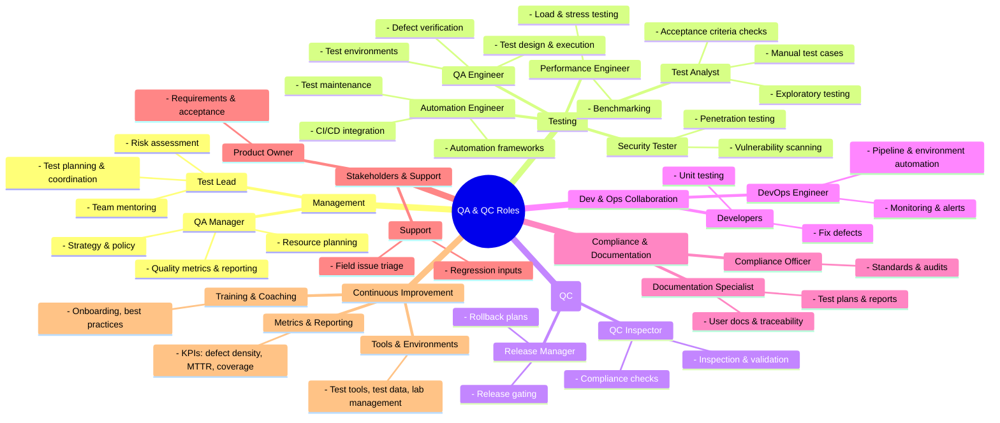

# QA & QC Roles Mindmap

```mermaid
mindmap
  root((QA & QC Roles))
    Management
      QA Manager
        - Strategy & policy
        - Quality metrics & reporting
        - Resource planning
      Test Lead
        - Test planning & coordination
        - Risk assessment
        - Team mentoring
    Testing
      QA Engineer
        - Test design & execution
        - Defect verification
        - Test environments
      Test Analyst
        - Manual test cases
        - Exploratory testing
        - Acceptance criteria checks
      Automation Engineer
        - Automation frameworks
        - CI/CD integration
        - Test maintenance
      Performance Engineer
        - Load & stress testing
        - Benchmarking
      Security Tester
        - Vulnerability scanning
        - Penetration testing
    Quality Control (QC)
      QC Inspector
        - Inspection & validation
        - Compliance checks
      Release Manager
        - Release gating
        - Rollback plans
    Dev & Ops Collaboration
      Developers
        - Fix defects
        - Unit testing
      DevOps Engineer
        - Pipeline & environment automation
        - Monitoring & alerts
    Compliance & Documentation
      Compliance Officer
        - Standards & audits
      Documentation Specialist
        - Test plans & reports
        - User docs & traceability
    Stakeholders & Support
      Product Owner
        - Requirements & acceptance
      Support
        - Field issue triage
        - Regression inputs
    Continuous Improvement
      Metrics & Reporting
        - KPIs: defect density, MTTR, coverage
      Tools & Environments
        - Test tools, test data, lab management
      Training & Coaching
        - Onboarding, best practices
```
